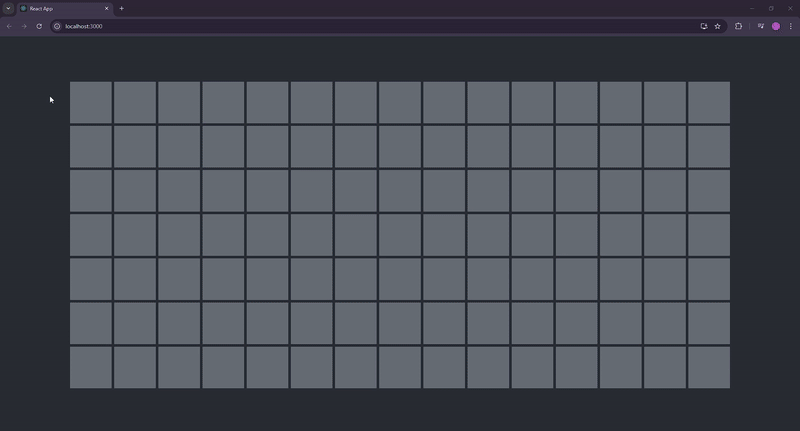

# Technicolor Boxes
In this project, I learned React.js by creating a webpage full of boxes that change color when they are hovered over. The boxes maintain their new color until hovered over again. It looks like this!:

I found this to be a great introduction to React. Below I have compiled lists of my successes and struggles with this project, as well as my biggest takeaway. Thanks for checking out my project!

## The Successes!
- By the end, I felt much more comfortable with React
- Some of the tangents I went down in trying to understand JSX allowed me to learn way more about React than I otherwise would have
- This project helped solidify to me the way files speak to each other inside a program. I enjoyed creating a good portion of the app in one file and breaking it up when it felt like a good time to do so.

## The Struggles!
- I learned in this project to follow the tutorial all the way through. Several times I learned a piece of information that I could immediately apply to this project and would do so to great effect!... Until the next step where I would try to figure something out to no avail before return to the tutorial. Lo and behold, that next step was often the nect step in the tutorial.
-

## My Biggest Takeaway
Learning and feeling more confident with React has been a very rewarding experience. As someone who enjoys front end design, It's very fulfilling to see my ideas come to life on the page. Though this was ultimately a tiny project, it sent my mind soaring with possibilities. I can't wait to get to the Next(.js) one!